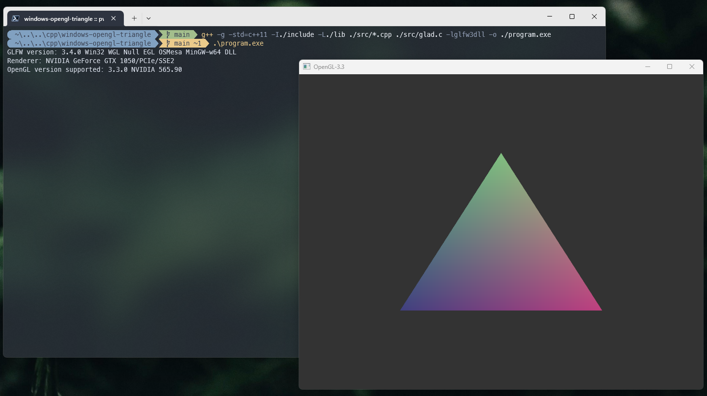

# Windows OpenGL Triangle

This example contains a basic OpenGL project that uses **GLAD** for loading OpenGL functions (version **3.3**) and **GLFW** for window management and user input. The code renders a simple triangle in an OpenGL window in a Windows environment. The demo only uses **Visual Studio Code** as the IDE.

____



#### Compilation command

```powershell
g++ -g -std=c++11 -I./include -L./lib ./src/*.cpp ./src/glad.c -lglfw3dll -o ./program.exe
```

Explanation:

1. **`g++`**: The compiler being used.
2. **`-g`**: Option to generate debugging information.
3. **`-std=c++11`**: Specifies the C++11 standard.
4. **`-I./include`**: Includes the `include` folder for header files.
5. **`-L./lib`**: Adds the `lib` folder where the libraries are located.
6. **`./src/*.cpp ./src/glad.c`**: Specifies the source files to be compiled.
7. **`-lglfw3dll`**: Links the `glfw3dll` dynamic library.
8. **`-o ./program.exe`**: Specifies the output file, in this case, `program.exe`.

This command should be run in the root directory of your project.

The following file structure is organized to ensure the project works correctly:

- The `.vscode` folder contains `tasks.json` for automating build tasks (optional).
- The `include` folder holds the necessary header files for **GLAD**, **GLFW**, and **KHR**.
- The `lib` folder stores the compiled GLFW libraries.
- The `src` folder contains the source files (`main.cpp` and `glad.c`) for the project.
- **glfw3.dll** is placed in the root directory for dynamic linking during runtime.

This structure is essential for the correct functioning of the files, ensuring that the libraries and source files are organized and accessible during compilation and execution.

#### Dependencies

- [GLAD Web Service](https://glad.dav1d.de/): A web-based tool for generating OpenGL loaders, customizable by API version and extensions.
- [GLFW Download Page](https://www.glfw.org/download.html): Official download page for GLFW, a library used to manage windows and input in OpenGL applications.

The necessary dependencies are also located in`./assets/dependencies`